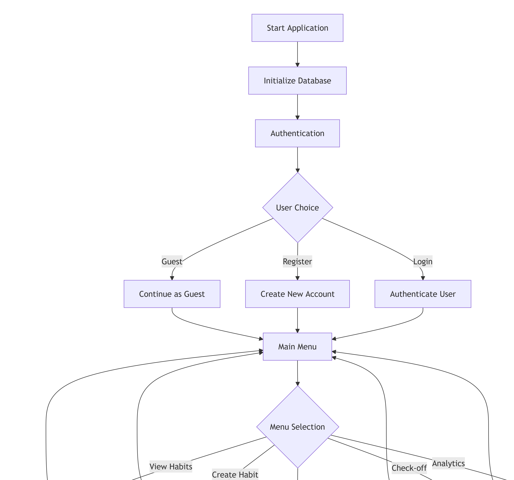
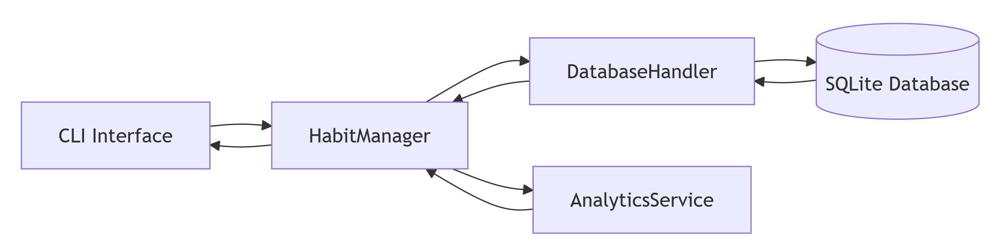

# Habit Tracker 🚀

A Python-based habit tracking application built with Object-Oriented Programming (OOP) and Functional Programming (FP) paradigms for the DLBDSOOFPP01 course portfolio.

## Table of Contents
- [Conception Phase](#conception-phase)
- [UML Class Diagram](#uml-class-diagram)
- [System Flowchart](#system-flowchart)
- [Features](#features)
- [Requirements](#requirements)
- [Setup](#setup)
- [How to Run](#how-to-run)
- [How to Test](#how-to-test)
- [Project Structure](#project-structure)
- [Predefined Habits](#predefined-habits)
- [Development Notes](#development-notes)

## Conception Phase

The initial design and planning documentation for this project is available here:  
📄 **[Phase 1 Conception Document](./docs/phase1_conception.pdf)**

This document includes:
- Detailed requirements analysis
- System architecture planning
- Technical specifications
- Initial UML diagrams and flowcharts
- Project scope and objectives

## UML Class Diagram

### Habit Tracker Class Hierarchy

Key OOP Concepts Demonstrated:

    Inheritance: DailyHabit and WeeklyHabit extend BaseHabit

    Polymorphism: Different is_due_on() implementations

    Encapsulation: Private attributes with public methods

    Composition: Habits contain Completion objects

    Abstraction: BaseHabit defines interface for all habits

# System Flowchart
## Application Workflow


# Database Interaction Flow



## Features
# Core Functionality

    ✅ Habit Management: Create, view, and track daily/weekly habits

    ✅ Completion Tracking: Check off habits with optional notes and mood scores (1-10)

    ✅ Streak Analytics: Calculate current and longest streaks for each habit

    ✅ Periodicity Support: Daily and weekly habit types with different tracking logic

    ✅ Data Persistence: SQLite database for habit storage between sessions

## Technical Features

    🏗️ Object-Oriented Design: Clean class hierarchy with inheritance and polymorphism

    🧮 Functional Programming: Pure functions for analytics and streak calculations

    🧪 Comprehensive Testing: 52/52 tests passing with pytest

    💾 Database Integration: SQLite with proper schema design

    🖥️ CLI Interface: Interactive menu system using Questionary library

# Requirements
Python Version

    Python 3.7 

## Dependencies

`questionary`

`pytest`

## Installation
#Install required packages

`pip install -r requirements.txt`

# Setup
## Clone the Repository
`git clone https://github.com/ipadeolaoluwatoyin7880/habit_tracker.git
cd habit_tracker`

## Install Dependencies
`pip install -r requirements.txt`

## Database Setup

The application automatically creates the SQLite database (data/habits.db) on first run.
# How to Run
## Start the Application

`python main.py`

# Application Flow
    Authentication: Login, register, or continue as guest

    Main Menu: Access all features through interactive menus

    Habit Management: Create, view, and check off habits

    Analytics: View streaks and completion statistics

    Data Persistence: All data automatically saved to database
# How to Test
## Run All tests
`python -m pytest tests/ -v`
## Project Structure

```text
habit_tracker/
├── 📁 docs/                   # Documentation
│   └── phase1_conception.pdf # Phase 1 submission document
├── 📁 src/                    # Source code
│   ├── 📁 cli/               # Command-line interface
│   │   └── user_interface.py # Main UI class
│   ├── 📁 data_model/        # OOP domain models
│   │   ├── habit.py          # BaseHabit, DailyHabit, WeeklyHabit
│   │   └── completion.py     # Completion class
│   ├── 📁 managers/          # Business logic layer
│   │   └── habit_manager.py  # Core application logic
│   ├── 📁 storage/           # Data persistence
│   │   └── db.py            # Database handler
│   └── 📁 analytics/         # Functional programming
│       └── analytics_service.py # Pure functions for analytics
├── 📁 tests/                 # Test suite (52 tests)
│   ├── test_habit.py         # OOP model tests
│   ├── test_analytics.py     # FP function tests  
│   ├── test_db.py            # Database tests
│   ├── test_integration.py   # End-to-end tests
│   └── test_cli.py           # UI interaction tests
├── 📁 data/                  # Database storage
│   └── habits.db            # SQLite database (auto-created)
├── main.py                   # Application entry point
├── requirements.txt          # Python dependencies
└── README.md                # This documentation
```

 # This documentation

# Predefined Habits

## The application includes demo data with the following predefined habits:
Daily Habits

    Read 10 pages: Daily reading habit

    Exercise: Daily physical activity

    Meditate: Daily mindfulness practice

Weekly Habits

    Weekly Planning: End-of-week review and planning

    Clean House: Weekly cleaning routine

Demo Data Features

    4 weeks of sample tracking data

    Mixed completion patterns for testing analytics

    Mood scores and notes for realistic examples

# Development Notes
## Object-Oriented Programming Implementation

    BaseHabit abstract class with DailyHabit and WeeklyHabit implementations

    Polymorphism through different is_due_on() methods

    Encapsulation with private attributes and public methods

    Composition with Habit containing Completion objects

## Functional Programming Features

    Pure functions for streak calculations (calculate_current_streak, calculate_longest_streak)

    Immutability in data processing

    Higher-order functions for filtering and mapping

    Function composition for complex analytics

## Database Design
sql

-- #_Normalized schema with foreign key relationships_

`habits (habit_id, name, periodicity, created_at, is_active)

completions (completion_id, habit_id, timestamp, notes, mood_score)`

## Testing Strategy

    Test-driven development approach

    Fixture-based testing with temporary databases

    Mock objects for isolated unit testing

    Integration tests for component interactions

## Challenges Overcome

    Complex streak logic for weekly habits using ISO calendar weeks

    Database connection management with proper resource cleanup

    OOP/FP integration for maintainable code structure

    Comprehensive test coverage with 52 passing tests

Course: DLBDSOOFPP01 - Object Oriented and Functional Programming with Python
Student: Oluwatoyin Eniola Ipadeola
Student ID: 92130758
Repository: https://github.com/ipadeolaoluwatoyin7880/habit_tracker