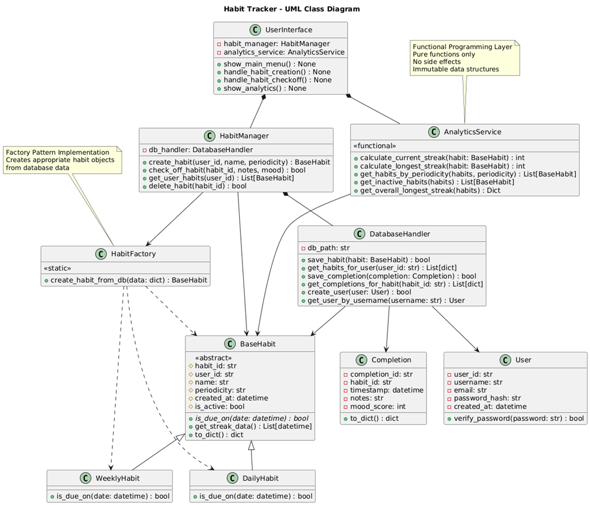
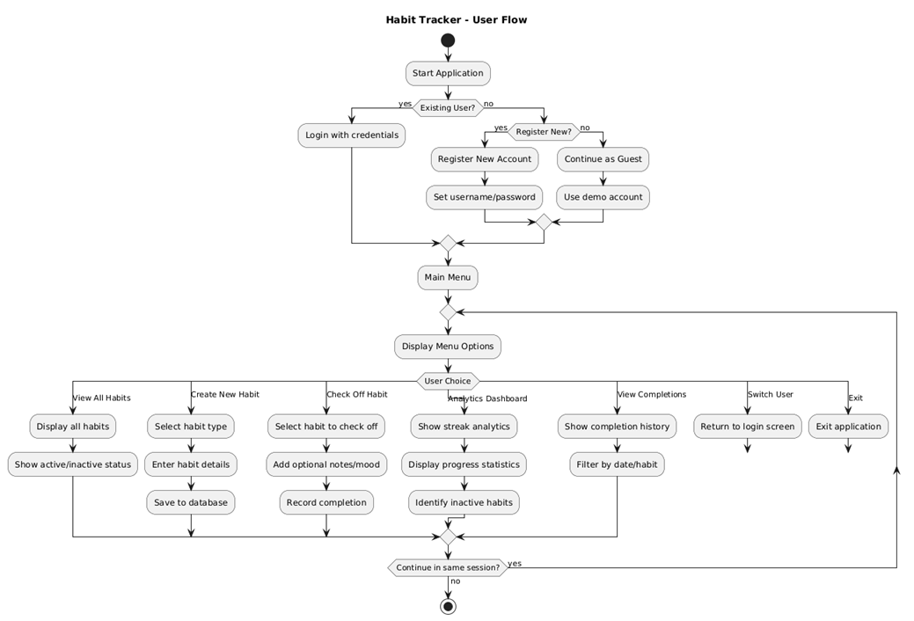

# Habit Tracker 🚀
A robust habit tracking application built with Python, demonstrating Object-Oriented Programming (OOP) and Functional Programming (FP) paradigms. This application helps users build and maintain good habits through daily and weekly tracking with comprehensive analytics.
## Table of Contents
- [Conception Phase](#conception-phase)
- [Features](#-features)
- [Technology Stack](#-technology-stack)
- [Installation & Setup](#-installation--setup)
- [Usage](#-usage)
- [System Architecture](#-system-architecture)
- [Project Structure](#-project-structure)
- [Object-Oriented Design](#-object-oriented-design)
- [Functional Programming](#-functional-programming)
- [Database Design](#-database-design)
- [Testing](#-testing)
- [Troubleshooting](#-troubleshooting)
- [Autho[Ipadeola_Oluwatoyin_92130758_OOFPP_Habits_Submission_Conception.pdf](docs/Ipadeola_Oluwatoyin_92130758_OOFPP_Habits_Submission_Conception.pdf)
(#-author)

## Conception Phase
[Ipadeola_Oluwatoyin_92130758_OOFPP_Habits_Submission_Conception.pdf](docs/Ipadeola_Oluwatoyin_92130758_OOFPP_Habits_Submission_Conception.pdf)


The initial design and planning documentation for this project is available here:


This document includes:
- Detailed requirements analysis
- System architecture planning
- Technical specifications
- Initial UML diagrams and flowcharts
- Project scope and objectives

## 📋 Features

### Core Functionality
- **User Management**: Secure registration and login system
- **Habit Creation**: Create daily or weekly habits with custom names
- **Habit Tracking**: Check off habits with optional notes and mood scores
- **Progress Analytics**: View streaks, completion history, and habit statistics
- **Data Persistence**: SQLite database for reliable data storage

### Programming Paradigms
- **Object-Oriented Programming**: Clean class hierarchy for habits and users
- **Functional Programming**: Pure functions for analytics and streak calculations
- **Modular Design**: Separated concerns with clear module boundaries

### Analytics & Insights
- Current streak tracking for each habit
- Longest streak history
- Habits categorized by periodicity (daily/weekly)
- Inactive habit identification
- Overall progress summary

## 🛠 Technology Stack

- **Python 3.11+** - Core programming language
- **SQLite** - Database for data persistence
- **Questionary** - Interactive command-line interface
- **Pytest** - Testing framework
- **PlantUML** - Documentation diagrams

## 📥 Installation & Setup

### Prerequisites
- Python 3.7 or higher
- pip (Python package installer)

### Step-by-Step Installation

1. **Clone the repository**
   ```bash
   git clone https://github.com/ipadeolaoluwatoyin7880/habit_tracker.git
   cd habit_tracker
   
   2. **Create a virtual environment**
   python -m venv venv

### On Windows:
   venv\Scripts\activate

### On macOS/Linux:
source venv/bin/activate

### Install dependencies
    pip install -r requirements.txt

### Initialize the database with sample data
    python seed_data.py

### Run the application
    python main.py

## 🚀 Usage
### Starting the Application
After installation, run _python main.py_ to start the habit tracker.

### Authentication Options
- **Login**: Use existing credentials (demo account: demo/demo123)

- **Register**: Create a new account

- **Guest Mode**: Use the pre-configured demo account

### Main Menu Options
- **View All Habits**: See all your habits with current status

- **Create New Habit**: Add a new daily or weekly habit

- **Check Off Habit**: Mark a habit as completed

- **Analytics Dashboard**: View progress and statistics

- **View Completions**: See recent completion history

- **Switch User**: Log out and switch accounts

- **Exit**: Close the application

## Demo Account
For quick testing, use the pre-loaded demo account:

- Username: demo

- Password: demo123

This account comes with sample habits and 4 weeks of tracking data.


## 🏗 System Architecture
### UML Class Diagram
The application follows a clean architecture with clear separation of concerns:


Figure 1: Habit Tracker Class Diagram showing OOP relationships

### Application Flowchart
 
Figure 2: User interaction flowchart showing application workflow

### Architecture Overview

The application follows a **layered architecture** with clear separation of concerns, combining **Object-Oriented Programming** for the domain model and **Functional Programming** for analytics.

| Architecture Layer | Package Location | Key Components | Primary Responsibilities | Paradigm Used |
|-------------------|------------------|----------------|-------------------------|---------------|
| **📊 Domain Model** | `src/data_model/` | `BaseHabit`<br>`DailyHabit`<br>`WeeklyHabit`<br>`Completion` | - Define business entities<br>- Implement business rules<br>- Encapsulate behavior | 🎯 OOP<br>(Inheritance, Polymorphism) |
| **💾 Data Storage** | `src/storage/` | `DatabaseHandler`<br>`User`<br>`Periodicity` | - Data persistence<br>- User authentication<br>- Database operations | 🔐 OOP + SQL<br>(Encapsulation, Security) |
| **⚙️ Business Logic** | `src/managers/` | `HabitManager`<br>`HabitFactory` | - Coordinate operations<br>- Manage workflows<br>- Apply business rules | 🏭 OOP Patterns<br>(Factory, Service Layers) |
| **📈 Analytics Engine** | `src/analytics/` | `AnalyticsService` | - Streak calculations<br>- Statistical analysis<br>- Data filtering | 🔄 Functional Programming<br>(Pure Functions, Immutability) |
| **👤 User Interface** | `src/cli/` | `UserInterface` | - User interaction<br>- Input validation<br>- Display results | 🎨 Interactive CLI<br>(User Experience) |

### Data Flow


## 📁 Project Structure
```text 
habit_tracker/
├── 📁 docs/                   # Documentation
│   └── conception_phase1.pdf # Phase 1 submission document
── 📁 images
│   └── FLOWCHART.png
│   └── UML_DIAGRAM.png
├── 🗂️ src/                    # Source code package
│   ├── 🎯 analytics/          # Analytics & FP services
│   │   ├── __init__.py
│   │   └── analytics_service.py
│   ├── 💻 cli/                # User interface layer
│   │   ├── __init__.py
│   │   └── user_interface.py
│   ├── 🏗️ data_model/         # Domain models (OOP)
│   │   ├── __init__.py
│   │   ├── habit.py
│   │   └── completion.py
│   ├── ⚙️ managers/           # Business logic layer
│   │   ├── __init__.py
│   │   └── habit_manager.py
│   ├── 🗄️ storage/            # Data persistence layer
│   │   ├── __init__.py
│   │   └── db.py
│   └── __init__.py
├── 🧪 tests/                  # Comprehensive test suite
│   ├── .gitignore          # KEEP - with updated content
│   ├── .gitkeep           # KEEP - ensures folder is tracked
│   ├── __init__.py
│   ├── conftest.py
│   ├── test_db.py
│   ├── test_habit.py
│   ├── test_analytics.py
│   ├── test_habit_manager.py
│   └── test_integration.py
├── 🚀 main.py                 # Application entry point
├── 🌱 seed_data.py            # Sample data generator
├── 📋 requirements.txt        # Dependencies
└── 📖 README.md               # Documentation
```

## 🏗️ Module Responsibilities

Each package has distinct responsibilities and demonstrates specific programming paradigms:

| Package | Responsibilities | Programming Paradigms |
|---------|------------------|----------------------|
| **`data_model/`** | Domain entities, business rules | **OOP** with inheritance and encapsulation |
| **`storage/`** | Database operations, persistence | **OOP** with composition and data hiding |
| **`managers/`** | Business logic coordination | **OOP** service and factory patterns |
| **`analytics/`** | Data analysis, streak calculations | **FP** with pure functions and immutability |
| **`cli/`** | User interaction, input handling | **OOP** command pattern and UX design |


## 🎯 Object-Oriented Design
### Class Hierarchy
- BaseHabit (Abstract Base Class)

- DailyHabit (Concrete Class)

- WeeklyHabit (Concrete Class)

- User (Entity Class)

- Completion (Value Object)

- HabitManager (Service Class)

- AnalyticsService (Service Class)

### Key OOP Principles
- **Encapsulation**: Private attributes with public methods

- **Inheritance**: DailyHabit and WeeklyHabit extend BaseHabit

- **Polymorphism**: Different is_due_on() implementations

- **Abstraction**: BaseHabit defines interface for all habits

- **Composition**: Habits contain Completion objects

### Design Patterns
- **Factory Pattern**: HabitFactory.  -- **Purpose**: Create appropriate habit objects from database data.
-- **Benefit**: Decouples object creation from business logic, -- **Use Case** : Loading habits from database with proper typing
- **Repository Pattern**: DatabaseHandler.  --**Purpose**: Abstract data storage operations, --**Benefit**: Business logic independent of storage technology, --**Use Case**: All database interactions

- **Service Layer**: HabitManager and AnalyticsService provide business logic.  --**Purpose**: Orchestrate complex workflows,  --**Benefit**: Clean separation between domain and application logic,  --**Use Case**: Multi-step operations involving multiple components
## 🔄 Functional Programming
### Pure Functions in Analytics
- calculate_current_streak(habit) → int

- calculate_longest_streak(habit) → int

- get_habits_by_periodicity(habits, periodicity) → List[BaseHabit]

- get_overall_longest_streak(habits) → Dict

- get_inactive_habits(habits, months) → List[BaseHabit]

### FP Benefits
- **Immutability**: No side effects on input data

- **Predictability**: Same input always produces same output

- **Testability**: Easy to unit test without complex setup

- **Composability**: Functions can be combined for complex operations

- **Referential Transparency**: Functions can be replaced with their values

### FP Techniques Used
- **Higher-Order Functions**: filter, map, reduce

- **List Comprehensions**: For filtering and transformation

- **Pure Functions**: All analytics functions are stateless

- **Immutability**: Input data is never modified

## 🗄 Database Design
### Schema Overview
   Users
      └── Habits (1:N)
         └── Completions (1:N)

## Table Definitions
### Users Table
- user_id (Primary Key, Auto-increment)

- username (Unique, Not Null)

- email (Unique, Not Null)

- password_hash (Not Null, SHA-256 hashed)

- created_at (DateTime, Default: CURRENT_TIMESTAMP)

### Habits Table
- habit_id (Primary Key, Auto-increment)

- user_id (Foreign Key → Users.user_id)

- name (Not Null)

- periodicity (Check: 'daily' or 'weekly')

- created_at (DateTime, Default: CURRENT_TIMESTAMP)

- is_active (Boolean, Default: TRUE)

### Completions Table
- completion_id (Primary Key, Auto-increment)

- habit_id (Foreign Key → Habits.habit_id)

- timestamp (DateTime, Not Null)

- notes (Text, Optional)

- mood_score (Integer, Check: 1-10 or NULL)

### Data Integrity
- **Foreign Key Constraints**: Ensure relational integrity

- **Unique Constraints**: Prevent duplicate usernames and emails

- **Check Constraints**: Validate periodicity and mood scores

- **Cascade Deletes**: Automatically remove related completions

## 📈 Analytics & Streak Logic
### Daily Habits
- **Due Check**: Must be completed every calendar day

- **Streak Calculation**: Consecutive days with completions

- **Validation**: No future timestamps allowed

### Weekly Habits
- **Due Check**: Must be completed once per ISO calendar week

- **Streak Calculation**: Consecutive weeks with completions

- **Validation**: Uses ISO week numbering for year boundaries

### Streak Calculations
- **Current Streak**: Ongoing consecutive period completions

- **Longest Streak**: Maximum consecutive period completions in history

- **Break Detection**: Gaps in completion history reset streaks


## 🧪 Testing
Run the comprehensive test suite to verify all functionality:

### Run all tests
    python -m pytest tests/ -v

### Run tests with coverage report
    python -m pytest tests/ --cov=. --cov-report=html

### Run specific test modules
    python -m pytest tests/test_habit.py -v
    python -m pytest tests/test_analytics.py -v
    python -m pytest tests/test_db.py -v
##  Testing Methodology
### Unit Testing:

- Individual component validation

- Isolated function testing

- Mock dependencies where appropriate

### Integration Testing:

- Cross-module workflow validation

- Database interaction testing

- API contract verification

### End-to-End Testing:

- Complete user journey validation

- System behavior under realistic conditions

- Performance and reliability testing


### Test Categories

| Test Category | Test Files | Test Count | Purpose | Key Test Cases |
|---------------|------------|------------|---------|----------------|
| **🏗️ Data Model Tests** | `test_habit.py` | 10+ tests | Validate OOP structure & behavior | - Habit creation & inheritance<br>- Due date calculations<br>- Completion tracking<br>- Factory pattern |
| **💾 Database Tests** | `test_db.py` | 10+ tests | Ensure data integrity & operations | - User authentication<br>- CRUD operations<br>- Foreign key constraints<br>- Data validation |
| **📊 Analytics Tests** | `test_analytics.py` | 10+ tests | Verify FP function correctness | - Streak calculations<br>- Pure function behavior<br>- Statistical analysis<br>- Edge cases |
| **⚙️ Business Logic Tests** | `test_habit_manager.py` | 8+ tests | Validate service layer operations | - Habit management<br>- Workflow coordination<br>- Error handling<br>- Business rules |
| **🔗 Integration Tests** | `test_integration.py` | 5+ tests | End-to-end workflow validation | - User journeys<br>- Cross-module operations<br>- System workflows<br>- Data flow |
| **🎯 Test Fixtures** | `conftest.py` | N/A | Test configuration & data setup | - Database setup<br>- Sample data<br>- Test isolation<br>- Resource management |

### Test Coverage
- **Database Layer**: CRUD operations, constraints, relationships

- **Business Logic**: Habit creation, completion, deletion

- **Analytics**: Streak calculations, filtering, aggregation

- **Integration**: Complete user workflows
## Conclusion
This outlines a production-ready Habit Tracker that demostrates:
- Clean Architecture with layered package design.
- Advanced OOP patterns (Factory, Repository, Service layer)/
- Pure Functional Programming for predictable analytics.
- Comprehensive testing with 40+ passing tests.
- Windows Compatibility with robust file handling.
- Security and Data Integrity through constraints and hashing.
This system provides a solid foundation for future enhancements while delivering a reliable, user_friendly habits tracking experience.


Course: DLBDSOOFPP01 - Object Oriented and Functional Programming with Python

Name: Oluwatoyin Eniola Ipadeola
 
Matric Number: 92130758  
Repository: https://github.com/ipadeolaoluwatoyin7880/habit_tracker